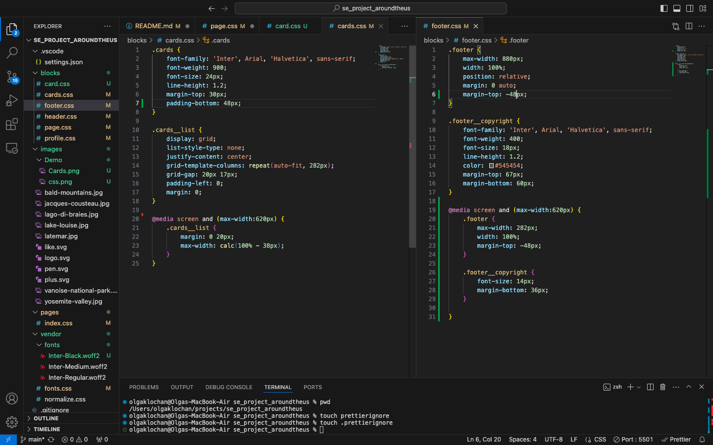

# Project 3: Around The U.S.

### Overview  

* Intro 
* Description 
* Images  
* Summary
  
**Intro**
  
Around the U.S. is the third project in the Software Engeneering Program at TripleTen. It was created using HTLM and CSS  based on designer's brief through Figma. This project is made so all the elements are displayed correctly on popular screen sizes. The page is easy to interect with and easy to read on any screen size using @meadia rule.

**Description**

In this project I used both flexbox and grid container to make the page most responsive on any screen size. Use of max-width and width to make the site easy to navigate and make it a pleasant experience. 

To make sure the footer stays at the right place regardless of the screen-size, I imlplemented "sticky" footer using margin/padding to achive that.

**Images**  
  
Images have been exported directry from Figma's design and optimized to be best responsive with the page. 

**Summary**

Check out the full Project at [Github](https://olgas111.github.io/se_project_aroundtheus/)

You can watch a quick video about the poject here: https://www.loom.com/share/11521b5a708149dcabbfc4bf198205bd 